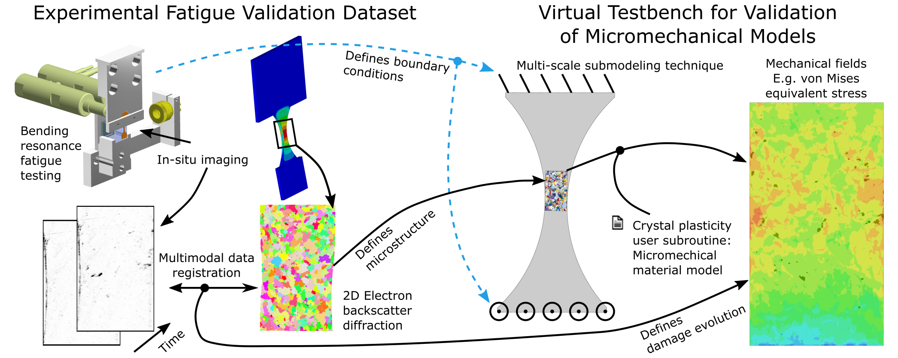

<!---

    Copyright (c) 2021 Robert Bosch GmbH and its subsidiaries.
    Copyright (c) 2021 Fraunhofer-Institut für Werkstoffmechanik IWM.

-->

<!---
    Size IWM image 605x165 => aspect ratio 3.6667
    Size Bosch image 200x200 => aspect ratio 1
-->
<pre>
      
</pre>

# ViTeMi - Virtual Testbench for Micromechanical Fatigue Models

This repository contains the companion material for the following publication:

> *Ali Riza Durmaz, Erik Natkowski, Nikolai Arnaudov, Petra Sonnweber-Ribic, Stefan Weihe, Sebastian Münstermann,
Chris Eberl, Peter Gumbsch* - **Micromechanical fatigue experiments for validation of microstructure-sensitive fatigue simulation models**,
International Journal of Fatigue 160 (2022), DOI: [10.1016/j.ijfatigue.2022.106824](https://doi.org/10.1016/j.ijfatigue.2022.106824)

Please cite this paper if using the dataset or the code, and direct any questions regarding the dataset
to [Ali Riza Durmaz](mailto:ali.riza.durmaz@iwm.fraunhofer.de), and any questions regarding the code to
[Erik Natkowski](mailto:erik.natkowski@de.bosch.com).

This work is released in collaboration of **Fraunhofer-Institut für Werkstoffmechanik IWM** and **Robert Bosch GmbH**.

## Purpose of this Software 

This software is a research prototype, solely developed for and published as
part of the publication cited above. It is not guaranteed to be maintained nor monitored in any way.

## Structure of ViTeMi

The general procedure is as shown in the above image.
Experimental high cycle fatigue data for a mesoscale fatigue specimens was acquired, among others, in form of EBSD measurements and image series capturing local damage evolution.
Based on the specimen's shape, a macro simulation is carried out.
Subsequently, based on the EBSD data, a micromechanical simulation model using a crystal plasticity, material subroutine uses the macro model for the prescription of boundary conditions.
From this model, e.g. fatigue indicator parameters (FIPs) can be determined and correlated with the experimentally observed damage locations to check the model's validity.

Accordingly, the repository consists of three main subfolders:
  - In `data`, the relevant experimental data an the access to it is described
  - `simulation` contains model files and helper scripts for the simulation
  - Useful Python scripts to plot data are contained in `script`

Detailed documentation and instructions for usage of the materials provided are found in the `readme.md` files in the respective folders and subfolders.

## File hosting

Most of the data and code is found in this repository.
Larger files, e.g. experimental data or FEM result files are hosted externally on [Fordatis](https://fordatis.fraunhofer.de/).

## License

Experimental data files (in `data`) are made available under the [Creative Commons Attribution 4.0 International License (CC-BY-4.0)](http://creativecommons.org/licenses/by/4.0/). 
Model and source code files (`model` and `script`) are made available under the 3-Clause BSD License, located in the `LICENSE` file. 
